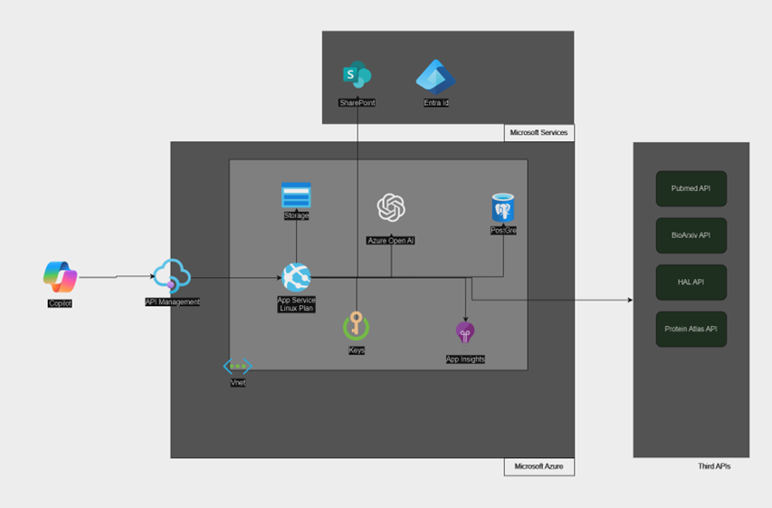

# Copilot for Researcher - Azure Setup Guide

## Prerequisites
Before you begin, ensure that the following requirements are met:

- Azure CLI must be installed. [Installation Guide](https://learn.microsoft.com/en-us/cli/azure/install-azure-cli)
- PubMed API keys are required.
- Serp API keys are required.

- Azure CLI must be installed. [Installation Guide](https://learn.microsoft.com/en-us/cli/azure/install-azure-cli)

## Introduction




This guide provides step-by-step instructions for deploying the full infrastructure of Copilot for Researcher on Azure.

---

## Step 1: Create the Azure AD Application for CopilotForResearcher

1. Open a PowerShell command prompt.
2. Run the following script:
   ```powershell
   ./create-azure-ad-app.ps1
   ```
3. Provide the required parameter:
   - `tenantId`: The Azure AD tenant ID where the application will be created.
4. Connect with a Tenant Administrator account.
5. The required scopes are:
   - `User.Read.All`: Application
   - `Sites.ReadWrite.All`: Application

---

## Step 2: Create the Connection Service Application

1. Open a PowerShell command prompt.
2. Run the script:
   ```powershell
   ./create-azure-ad-app.ps1
   ```
3. Provide the required parameter:
   - `tenantId`: The Azure AD tenant ID where the application will be created.
4. Connect with a Tenant Administrator account.
5. **Keep the client ID and client secret and send them to Witivio for setting up the DevOps pipeline.**

---

## Step 3: Create the Resource Group

Run the following script in PowerShell:
```powershell
./create-azure-resource-group.ps1
```
Provide the required parameter:
- `tenantId`: The Azure AD tenant ID where the resource group will be created.

---

## Step 4: Create Azure OpenAI Service

1. Open a PowerShell command prompt.
2. Run the script:
   ```powershell
   ./create-azure-openAI.ps1
   ```
3. Provide the following required parameters:
   - `Location`: "francecentral"
   - `SubscriptionId`: The subscription ID for the resource.
4. **Keep the `endpointName` and `apiKey` generated for the next step.**

---

## Step 5: Create the Master Key Vault and Configure Secrets

1. Open a PowerShell command prompt.
2. Run the script:
   ```powershell
   ./create-azure-master-kv.ps1
   ```
3. Provide the following required parameters:
   - `Location`: "francecentral"
   - `SubscriptionId`: The subscription ID for the resource.
   - `AzureClientId`
   - `AzureClientSecret`
   - `AzureOpenAIEndpoint` (from the previous step)
   - `AzureOpenAIApiKey` (from the previous step)
   - `AzureConnexionServiceAppId`

4. **Access the Key Vault (cfr-master-kv):**
   - Go to the [Azure Portal](https://portal.azure.com/).
   - Navigate to **Key Vaults**.
   - Find **cfr-master-kv**.
   - In the left-hand menu, select **Secrets**.
   - Locate the generated secret and save it securely.

---

## Step 6: Register Resource Providers

1. Go to the [Azure Portal](https://portal.azure.com/).
2. Navigate to your subscription.
3. In the left-hand panel, go to:
   - **Settings** > **Resource Providers**.
4. Register the following providers:
   - Microsoft.CognitiveServices
   - Microsoft.Authorization
   - Microsoft.App
   - Microsoft.ApiManagement
   - Microsoft.Storage
   - Microsoft.Network
   - Microsoft.DBforPostgreSQL
   - Microsoft.Insights

---

## Step 7: Configure Resource Group Permissions

1. In the Azure Portal, navigate to your resource group (e.g., `cfr-prd`).
2. Click **Access Control (IAM)**.
3. Click **Add > Add Role Assignment**.
4. Select **Privileged Administrator Roles**, then click **Next**.
5. Select **User, Group, or Service Principal**, and choose **cfr-copilotforresearcher-agent**.
6. Click **Next**, then **Add Constraint Roles** and **Configure**.
7. Assign the following roles:
   - Key Vault Administrator
   - Key Vault Crypto Officer
   - Key Vault Crypto User
   - Key Vault Reader
   - Key Vault Secrets Officer
8. Click **Select**, then **Save**.

---

## Step 8: Create SharePoint Lists

1. Create a SharePoint site if one does not exist.
2. Create a SharePoint list named **RewriteRules** with columns:
   - Title
   - MaxWords (Text)
   - TextType (Text)
3. Create a SharePoint list named **IndexingLogs** with columns:
   - Title
   - TotalPages (Text)
   - Status (Text)
   - FullPath (Text)
   - IndexingData (Text)
4. Set the **Title** column as an indexed column in each list.

---

## Step 9: Edit the Master Key Vault and Secrets

1. Go to the Azure Portal > **Key Vaults** > **cfr-master-kv**.
2. Edit the secret values:
   ```json
   {
     "SerpApiApiKey": { "value": "[ID]"},
     "PubmedApiKeys0": { "value": "[ID]"},
     "AzureTenantId": { "value": "[Your Tenant ID]"},
     "AzureClientId": { "value": "[Azure Client ID]"},
     "AzureClientSecret": { "value": "[Azure Client Secret]"},
     "SharePointUrl": { "value": "[SharePoint URL]"},
     "AzureOpenAIEndpoint": { "value": "https://cfr-openai.openai.azure.com/"},
     "AzureOpenAIApiKey": { "value": "[ID]"}
   }
   ```

---

## Step 11: Upload Teams App

To make the app available to users in your organization's app store:

1. Access **Teams Admin Center** and navigate to **Teams apps > Manage apps**.
2. Click **Upload new app** and select the app package provided.
3. The app will be available to users after a few hours.

For further details, refer to the [Microsoft Documentation](https://learn.microsoft.com/en-us/microsoftteams/teams-custom-app-policies-and-settings#upload-a-custom-app-using-teams-admin-center).

